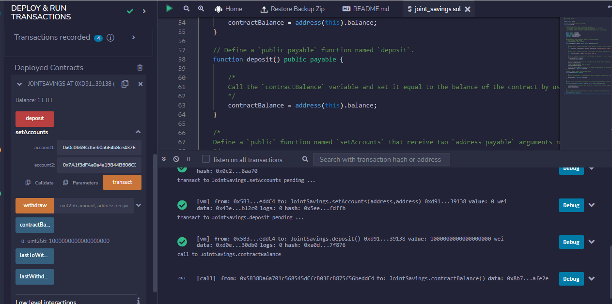
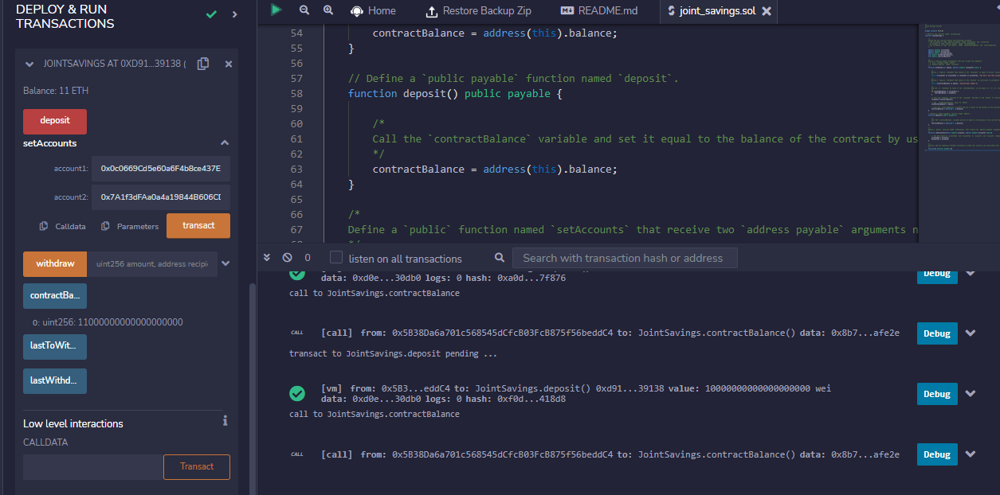
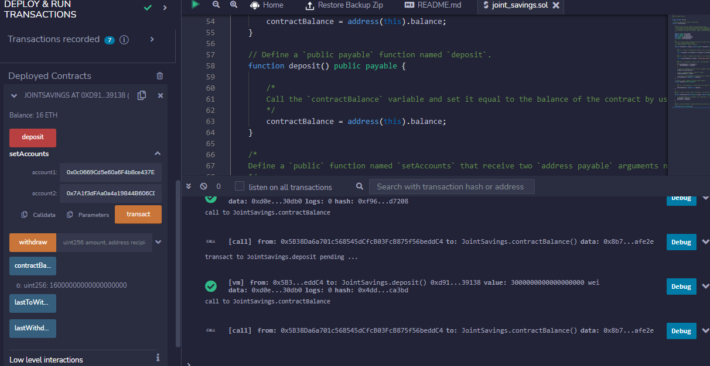
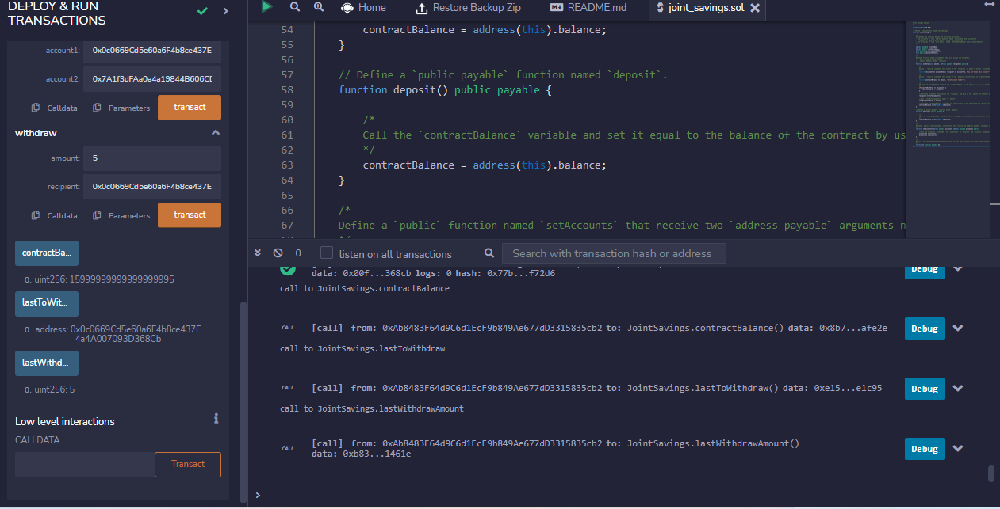
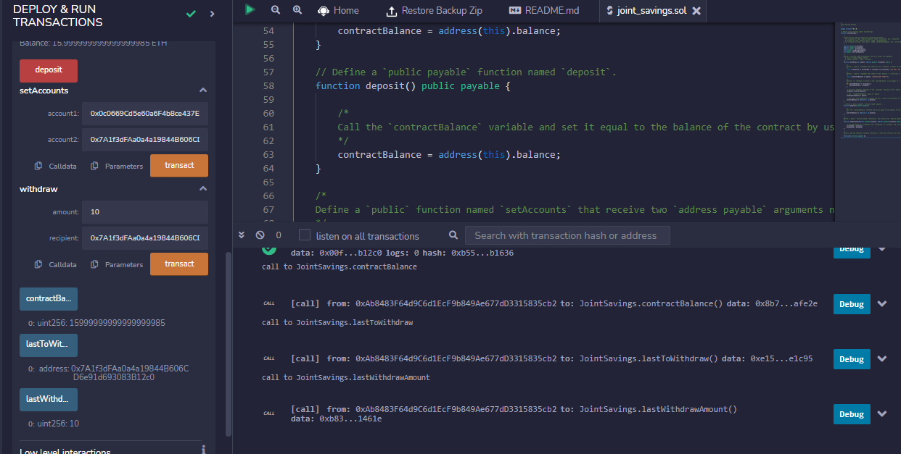

# Module20Challenge_Solidity_JointSavings

In this assignment a Solidity smart contract is created that accepts two user addresses. These addresses will be able to control a joint savings account. The smart contract uses ether management functions to implement a financial institution’s requirements for providing the features of the joint savings account. These features consists of the ability to deposit and withdraw funds from the account.

The steps for this assignment are divided into the following sections:

1. Creating a Joint Savings Account Contract in Solidity.

2. Compiling and Deploying the Contract in the Remix IDE.

3. Interact with the Deployed Smart Contract.

### Smart Contract interaction results

